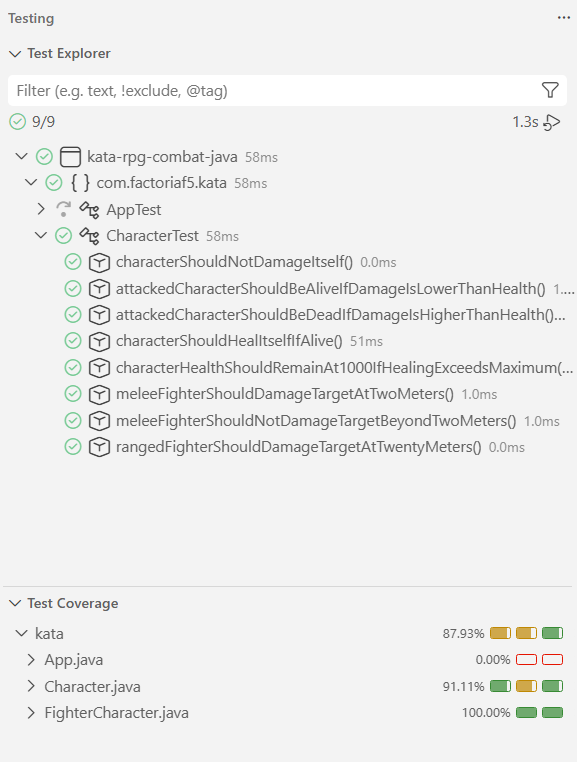

# Kata RPG Combat

This project is part of the programming exercises completed at Factoría F5.

#### Background

This is a fun kata in which the programmer builds simple combat rules for a role-playing game (RPG). It is implemented as a sequence of iterations.
The domain does not include a map, kills, or any character attributes apart from the characters' ability to damage and heal one another.

## Instructions

1. Iteration One:
   - All characters, when created, have:
     - Health starting at 1000.
     - Level starting at 1.
     - An alive or dead status, starting alive (represented by a boolean value).
   - Characters can deal damage to other characters.
     - Damage is subtracted from health.
     - When the damage received is equal to or greater than the current health, health becomes 0 and the character dies.
   - A character can heal another character.
     - Dead characters cannot be healed.
     - Healing cannot raise health above 1000.

2. Iteration Two:
   - A character cannot deal damage to itself.
   - A character can only heal itself.
   - When dealing damage:
     - If the target is five or more levels above the attacker, damage is reduced by 50%.
     - If the target is five or more levels below the attacker, damage is increased by 50%.

3. Iteration Three:
   - Characters have a maximum attack range.
   - Melee fighters have a range of 2 meters.
   - Ranged fighters have a range of 20 meters.
   - Characters must be within range to deal damage to a target.

## Technologies

- Java 21
- Maven
- JUnit 5
- JaCoCo

## Installation

Clone the repository:

```bash
git clone https://github.com/Alexapop/kata-java-tdd-RPG-Combat.git
```

Run the tests:

```bash
mvn test
```

## Test Coverage

The project currently has 87.93% test coverage, measured using the VS Code
Testing tools.


